# Guide des exercices du programme

> Ce document décrit visuellement chaque exercice proposé dans l'application.  
> Clique sur un exercice pour voir son schéma, les muscles sollicités et les points de vigilance.

---

## Jour 1 — Mardi (Pectoraux / Dos / Bras)

### 1. Bench press haltères
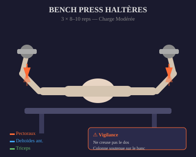

| | |
|:---|:---|
| **Muscles** | Pectoraux majeurs, deltoïdes antérieurs, triceps |
| **Position** | Allongé sur un banc plat, pieds au sol, haltères au-dessus des épaules |
| **Mouvement** | Descente contrôlée jusqu'à la poitrine, puis poussée verticale |
| **Vigilance** | Garde la colonne neutre. Ne creuse pas le dos. |

---

### 2. Rowing 1 bras (genou sur banc)
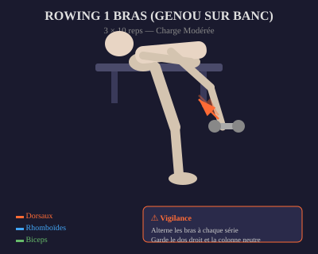

| | |
|:---|:---|
| **Muscles** | Dorsaux, rhomboïdes, trapèzes, biceps |
| **Position** | Un genou et une main sur le banc, buste parallèle au sol |
| **Mouvement** | Tire l'haltère vers la hanche en rentrant le coude le long du corps |
| **Vigilance** | Alterne les bras à chaque série. Garde le dos droit et la colonne neutre. |

---

### 3. Curl haltères
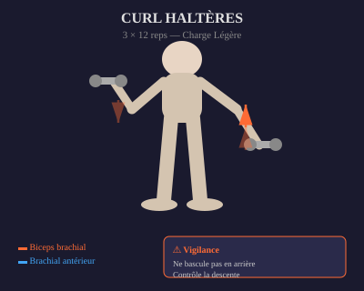

| | |
|:---|:---|
| **Muscles** | Biceps brachial, brachial antérieur |
| **Position** | Debout, bras le long du corps, paumes vers l'avant |
| **Mouvement** | Fléchis les coudes en montant les haltères sans balancer le buste |
| **Vigilance** | Ne bascule pas en arrière. Contrôle la descente. |

---

### 4. Extension triceps (couché ou debout)
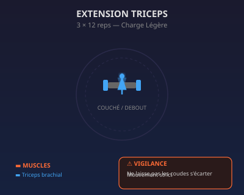

| | |
|:---|:---|
| **Muscles** | Triceps brachial |
| **Position** | Couché sur le banc ou debout, haltère au-dessus de la tête / poitrine |
| **Mouvement** | Extension des coudes en poussant l'haltère vers le haut / l'avant |
| **Vigilance** | Ne laisse pas les coudes s'écarter. Mouvement strict. |

---

## Jour 2 — Jeudi (Épaules / Jambes / Core)

### 5. Développé militaire assis
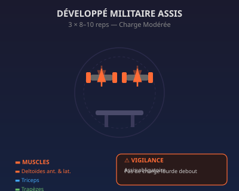

| | |
|:---|:---|
| **Muscles** | Deltoïdes antérieurs et latéraux, triceps, trapèzes |
| **Position** | Assis sur le banc, haltères au niveau des épaules, paumes vers l'avant |
| **Mouvement** | Pousse les haltères verticalement jusqu'à l'extension complète des bras |
| **Vigilance** | **Assis obligatoire**. Pas de charge lourde debout. |

---

### 6. Fentes alternées (haltères à la main)
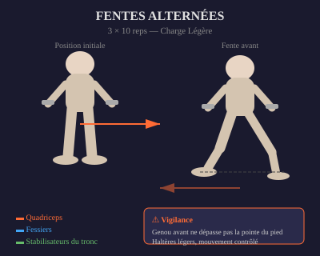

| | |
|:---|:---|
| **Muscles** | Quadriceps, fessiers, mollets, stabilisateurs du tronc |
| **Position** | Debout, haltères le long du corps |
| **Mouvement** | Grand pas en avant, genou arrière près du sol, reviens à la position initiale. Alterne. |
| **Vigilance** | Haltères légers, mouvement contrôlé, sans rebond. Genou avant ne dépasse pas la pointe du pied. |

---

### 7. Élévations latérales
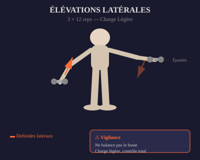

| | |
|:---|:---|
| **Muscles** | Deltoïdes latéraux (épaules) |
| **Position** | Debout, légèrement penché en avant, haltères le long du corps |
| **Mouvement** | Lève les bras latéralement jusqu'à l'horizontal, coudes légèrement fléchis |
| **Vigilance** | Ne balance pas le buste. Charge légère, contrôle total. |

---

### 8. Gainage ventral
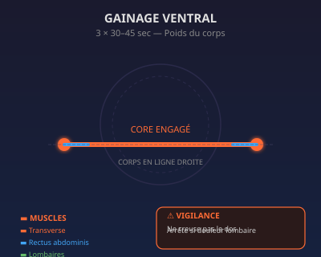

| | |
|:---|:---|
| **Muscles** | Transverse de l'abdomen, rectus abdominis, obliques, érecteurs du rachis |
| **Position** | Appui sur les avant-bras et la pointe des pieds, corps en ligne droite |
| **Mouvement** | Maintiens la position statique sans bouger (30–45 sec) |
| **Vigilance** | **Ne creuse pas le dos** : ventre rentré, fessiers serrés. Respire normalement. |

---

## Jour 3 — Samedi (Pectoraux / Dos / Bras)

### 9. Bench press prise serrée
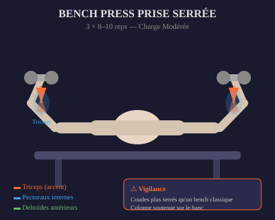

| | |
|:---|:---|
| **Muscles** | Triceps (accent), pectoraux internes, deltoïdes antérieurs |
| **Position** | Allongé sur le banc, haltères rapprochés au-dessus de la poitrine |
| **Mouvement** | Descente à la poitrine, poussée verticale en gardant les coudes près du corps |
| **Vigilance** | Colonne soutenue : ne creuse pas le dos. Coudes plus serrés qu'un bench classique. |

---

### 10. Rowing buste penché 2 bras
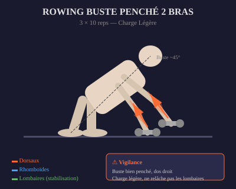

| | |
|:---|:---|
| **Muscles** | Dorsaux, rhomboïdes, trapèzes, biceps, érecteurs du rachis |
| **Position** | Buste penché à ~45°, dos droit, haltères pendant sous les épaules |
| **Mouvement** | Tire les deux haltères vers les hanches en rentrant les coudes |
| **Vigilance** | Buste bien penché, dos droit, charge légère. Garde le dos droit. |

---

### 11. Curl marteau
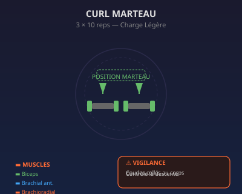

| | |
|:---|:---|
| **Muscles** | Biceps brachial, brachial antérieur, brachio-radial (avant-bras) |
| **Position** | Debout, bras le long du corps, paumes face à face (neutre) |
| **Mouvement** | Fléchis les coudes en montant les haltères sans tourner les poignets |
| **Vigilance** | Garde les poignets neutres tout le long. Pas d'oscillation du buste. |

---

### 12. Extension triceps corde ou haltère
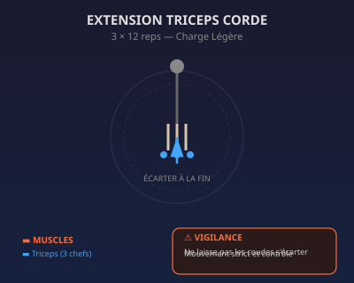

| | |
|:---|:---|
| **Muscles** | Triceps brachial |
| **Position** | Corde à la poulie haute ou haltère à deux mains derrière la tête |
| **Mouvement** | Extension des coudes en écartant les mains (corde) ou en poussant l'haltère |
| **Vigilance** | Ne laisse pas les coudes s'écarter latéralement. Contrôle la phase de retour. |

---

## Récapitulatif visuel des muscles

| Couleur | Zone | Exercices concernés |
|:---|:---|:---|
| 🔴 Rouge | Poitrine | Bench press, bench serré |
| 🔵 Bleu | Bras (biceps/triceps) | Curls, extensions, rowing |
| 🟡 Jaune | Taille / Core | Gainage, fentes |
| 🟢 Vert | Hanches / Fessiers | Fentes, gainage |
| 🟠 Orange | Cuisse | Fentes |
| 🟣 Violet | Mollet | — (exercice au poids du corps ou machine) |
